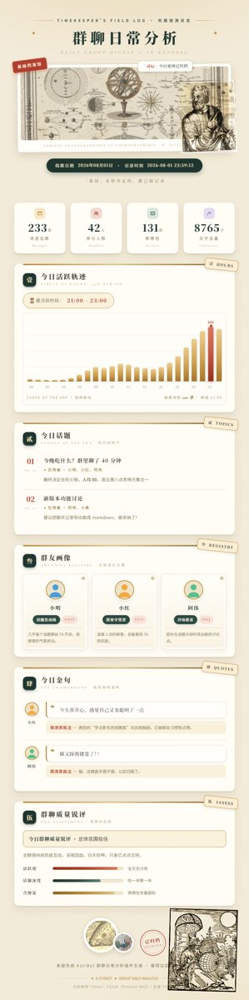

# 群聊日常分析 · 报告模板仓库（暴雨档案馆 Reverse: 1999）

本仓库是 [astrbot_plugin_qq_group_daily_analysis](https://github.com/SXP-Simon/astrbot_plugin_qq_group_daily_analysis)
的 **报告视觉模板仓库**，可以作为你自己的模板仓库的起点。

内置模板：**`gda_reverse_1999`（暴雨档案馆 Reverse: 1999）** —— 重返未来1999 风格羊皮纸手账，
米白纸底 × 1852 宇宙志镶框古图 × 墨绿鎏金圆角卡片，渐变柱图与朱红峰值，观星者纪念章页脚。

> 预览：
> 
>
> 完整长图见 [assets/gda_reverse_1999-demo.jpg](assets/gda_reverse_1999-demo.jpg)。

> 📌 **图片文件说明**（三张图用途不同，别混淆）：
> - `assets/gda_reverse_1999-demo-thumb.jpg` —— **本 README 展示用的缩略图**（宽 420 以内），
>   用于仓库首页快速预览效果；不参与模板运行，也不打包进 zip 之外的任何插件逻辑。
> - `assets/gda_reverse_1999-demo.jpg` —— **完整长图**，README 以链接附上，供点开看全部细节。
> - `gda_reverse_1999/preview.jpg` —— **随模板打包的预览图**：用户安装本模板后，
>   QQ `/查看模板` 与 WebUI 画廊显示的就是这张图（区别于上面两张仅作仓库展示）。
>
> 三者均由 `generate_preview.py` 一次生成。

## 一键安装（推荐）

在插件 Web 控制台 → 配置页 → 模板选择器旁「安装模板」→ GitHub 链接页签：

```
https://github.com/lingyun14beta/daily-analysis-report-theme-reverse1999
```

插件会自动下载源码、识别 `gda_reverse_1999/` 模板目录并安装，**无需重启机器人**。
也可以在本仓库页面点 `Code ▾ → Download ZIP`，然后在「安装模板 → 上传 zip」直接上传。

> 安装成功后模板会出现在「断点续跑」「免 Token 切换主题重绘」下拉中；
> 卸载请用同一入口旁的「卸载模板」（内置模板不可卸载）。

## 目录结构

```
daily-analysis-report-theme/
├── README.md                # 本说明
└── gda_reverse_1999/        # 模板根目录（zip 打包时打包这一层）
    ├── image_template.html  # 长图海报主骨架
    ├── html_template.html   # 独立网页主骨架
    ├── topic_item.html      # 话题列表模块
    ├── user_title_item.html # 群友称号与画像模块
    ├── quote_item.html      # 金句与锐评模块
    ├── activity_chart.html  # 24h 活跃轨迹模块
    ├── chat_quality_item.html # 群聊质量锐评模块
    ├── template.json        # 模板显示名 {"name": "暴雨档案馆 (Reverse: 1999)"}
    └── preview.jpg          # 随包预览图
```

## 快速自定义

所有视觉都由 `gda_reverse_1999/image_template.html` 头部 `:root { ... }` 的 CSS 变量控制：

```css
:root {
    --paper: #f4ecda;        /* 页面底色（米白羊皮纸） */
    --paper-2: #eee3c8;      /* 纸色加深 */
    --card: #fffdf6;         /* 卡片白 */
    --card-2: #faf3e3;       /* 卡片渐变暖端 */
    --ink: #3b372c;          /* 正文墨褐色 */
    --ink-soft: #8a8168;     /* 次要文字 */
    --ink-faint: #b5ab8e;    /* 弱化文字（拉丁副标题） */
    --gold: #b98a3c;         /* 鎏金 */
    --gold-light: #e0c48b;   /* 浅金（柱图高光） */
    --gold-deep: #8a6428;    /* 深金（柱图暗端/注释） */
    --green: #2d4a42;        /* 墨绿（称号标签/头像描边用） */
    --green-deep: #1f3530;   /* 深墨绿（标题/数据） */
    --rust: #b3402f;         /* 印泥朱红（序号/印章/峰值） */
    --line: rgba(146,121,74,0.20);   /* 细分隔线 */
    --line-strong: rgba(146,121,74,0.38); /* 强调描边 */
    --radius: 14px;          /* 卡片圆角 */
}
```

改完颜色即可得到自己的风格；改版式请直接修改对应 HTML 文件。
拉丁文装饰（副标题/图表注记）使用变量 `--font-latin`（默认 Cormorant Garamond 衬线斜体），
可整体替换为更衬主题的西文字体。

## 打包规范速查（安装器强制校验）

| 项 | 要求 |
| --- | --- |
| 单一模板 | 一个 zip 只含一个模板，多个模板目录会被拒绝 |
| 主文件 | 目录内必须有 `image_template.html` 或 `html_template.html` |
| 根目录 | 允许外层套一层目录（`repo-main` 形式自动剥离） |
| 大小 | 解压后 ≤ 64MB、单文件 ≤ 20MB、成员 ≤ 300 |
| 命名 | 建议小写英文蛇形（如 `gda_xxx`）、≤ 50 字符、无空格与特殊字符；与内置模板重名会被拒绝 |
| 显示名 | 可选 `template.json` 放在模板根目录：`{"name": "中文名", "desc": "说明", "tag": "复古金箔", "tag_color": "gold"}`（desc 显示在 WebUI 下拉/卸载弹窗，tag/tag_color 为下拉中的风格标签；字段均可选，仅 name 也可） |
| 预览图 | 可选 `preview.jpg/png` 或 `demo.jpg/png` 放在模板目录内：随 zip 一起打包安装后，QQ `/查看模板` 即可显示该预览图 |
| 模板内引用图片 | 只能用**绝对 URL（公开图库链接）**或**内联 data URI / `<svg>`**——报告 HTML 是字符串交给远端 T2I 渲染服务，**相对路径（如 `assets/bg.png`）渲染时必然 404**；预览图（preview.jpg）除外。小图标建议 base64/内联 SVG，大装饰图建议放本仓库 `assets/<模板名>/` 后用 jsDelivr 绝对链接（参考内置 HatsuneMiku 模板的做法） |
| 多余的脚本/文件 | 模板目录内可放置任意文件（安装器原样保留、运行时会忽略），但脚本类文件请留在仓库根，避免徒增 zip 体积 |

> 完整 `template.json` 示例（放模板根目录，与 `image_template.html` 同级）：
>
> ```json
> {
>   "name": "暴雨档案馆 (Reverse: 1999)",
>   "desc": "重返未来1999 暗夜档案馆：深夜墨绿 × 鎏金细线 × 印泥朱红，司辰的群聊观测档案",
>   "tag": "暗夜鎏金",
>   "tag_color": "gold"
> }
> ```
>
> 本仓库实际使用： [`gda_reverse_1999/template.json`](gda_reverse_1999/template.json)。
> 字段均可选（仅 `name` 即可），字符串长度上限 100，仅支持 JSON。

## 渲染变量契约

主骨架接收 `topics_html / titles_html / quotes_html / hourly_chart_html /
chat_quality_html` 五个 HTML 片段，以及 `message_count / participant_count /
total_characters / emoji_count / most_active_period / current_date / total_tokens`
等统计字段；子模块分别接收 `topics / titles / quotes / chart_data /
title+subtitle+dimensions+summary`。

完整变量表与子模块结构详见插件仓库
[`docs/REPORT_TEMPLATE_GUIDE.md`](https://github.com/SXP-Simon/astrbot_plugin_qq_group_daily_analysis/blob/main/docs/REPORT_TEMPLATE_GUIDE.md#3-渲染变量契约)。

## 自检脚本

仓库根提供 `verify_demo.py`，在修改模板后运行：

```bash
# 校验指定模板（语法 + StrictUndefined 渲染），缺省为 gda_reverse_1999
python verify_demo.py [模板名]

# 完整检查：额外模拟打包 zip 走一遍插件的安装/卸载流程
python verify_demo.py [模板名] <插件仓库路径>   # 插件路径也可用 PLUGIN_ROOT 环境变量
```

它会依次：校验全部 HTML 的 Jinja2 语法 → 用 StrictUndefined 实际渲染 7 个模板
（任何变量缺失/结构错误立即报错）→ 模拟打包 zip 走一遍插件的安装/卸载流程。

> 安装/卸载检查依赖插件仓库 `src/` 中的安装器（脚本内置 astrbot mock，可离线运行）。

## 预览图生成

仓库根提供 `generate_preview.py`，用无头浏览器（Chrome/Edge）渲染模板并生成：

- `assets/<模板名>-demo.jpg`（完整长图）
- `assets/<模板名>-demo-thumb.jpg`（README 展示缩略图）
- `<模板名>/preview.jpg`（随模板打包，供 `/查看模板` 显示）

```bash
python generate_preview.py [模板名]     # 缺省为 gda_reverse_1999
```

`verify_demo.py` 的 mock 数据在生成脚本中扩展成了更完整的示例内容
（3 位群友、2 条金句、质量锐评等），修改模板后重跑即可刷新预览图。

## 装饰图来源（公共领域，Wikimedia 直链）

模板使用三张 Wikimedia Commons 上**公共领域**古版画（绝对 URL，CDN 无防盗链、无需署名，
符合「模板内引用图片」规范）：

- **Vuillemin 1852 宇宙志图**（PD）—— 报头主视觉：镶框古图相册（`hero-art`）：
  `https://upload.wikimedia.org/wikipedia/commons/thumb/3/32/1852_Vuillemin_Astronomical_and_Cosmographical_Chart_-_Geographicus_-_Cosmographique-vuillemin-1852.jpg/1280px-1852_Vuillemin_Astronomical_and_Cosmographical_Chart_-_Geographicus_-_Cosmographique-vuillemin-1852.jpg`
- **Flammarion 木刻版画**（1888，佚名，PD，维基百科特色图片）—— 页脚纪念章（`footer-art`）：
  `https://upload.wikimedia.org/wikipedia/commons/thumb/d/dd/FlammarionWoodcut.jpg/1280px-FlammarionWoodcut.jpg`
- **Doppelmayr 1730 孔雀座星图**（PD）—— 页脚第二枚小纪念章（`footer-art2`）：
  `https://upload.wikimedia.org/wikipedia/commons/thumb/8/84/Johan_Doppelmayr%27s_celestial_chart_of_Pavo_and_Indus_%28cropped%29.jpg/1280px-Johan_Doppelmayr%27s_celestial_chart_of_Pavo_and_Indus_%28cropped%29.jpg`
- **持浑天仪的天文学家**（1584 版画，美国国会图书馆藏，PD）—— 头图主角「司辰」：
  贴在镶框古图右缘、配对话气泡（`hero-character` / `hero-bubble`）：
  `https://upload.wikimedia.org/wikipedia/commons/thumb/2/24/Astronomer_holding_instrument_LCCN2006691905.jpg/960px-Astronomer_holding_instrument_LCCN2006691905.jpg`
- **丢勒《天文学家》木刻**（Albrecht Dürer，PD）—— 页脚右下角探底大立绘（`deco-char`）：
  `https://upload.wikimedia.org/wikipedia/commons/3/3b/Durer_astronomer.jpg`

**人物用法**（对齐内置 ATRI / BlueArchive 模板的手法）：主角立绘以 `mix-blend-mode: multiply`
直接「印」在羊皮纸卡上（版画白底与纸底融合，无需抠图），配 `filter: grayscale+sepia` 统一色调；
对话气泡用纯 CSS 小尾巴指向人物；页脚人物绝对定位右下、底部探出页边（`bottom: -6px`）；
群友卡可选 `title.profile_image`（插件注入）做右下角 12% 透明淡印（`.t-profile`）。

三张图在模板里通过 `background-image` 引用（失败时优雅降级、不破坏版面）。
`assets/<模板名>/art/` 下保存了本地副本：`generate_preview.py` 渲染预览图时会把直链
替换为本地文件 `file://` 路径，避免预览机 IP 被 Wikimedia 限流（429）导致截图缺图；
**模板文件本身始终引用直链，不依赖本地副本**。

## 许可

MIT，可自由复制修改。
